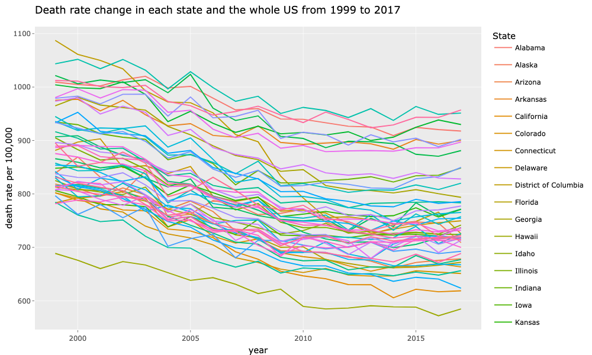

```{r setup, include=FALSE, message=FALSE, echo=FALSE, warning=FALSE}
knitr::opts_chunk$set(echo = TRUE, warning = FALSE)
library(tidyverse)
library(tidytext)
library(data.table)
library(httr)
library(leaflet)
library(dplyr)
library(plotly)
library(DT)
library(knitr)
library(htmlTable)


# INITALIZE CODE CHUNK OPTIONS
opts_chunk$set(
  warning = FALSE,
  message = FALSE,
  eval=TRUE,
  echo = FALSE,
  cache = FALSE,
  tidy = TRUE,
  fig.width = 7, 
  fig.align = 'center',
  fig.asp = 0.618,
  out.width = "700px",
  class.source = "code-r")
```

\newpage

# 1 Introduction

  With the development of science and technology and medical standards, human beings have greater and greater expectations for avoiding death. This project analyzed the ten leading causes of death in the United States that the National Vital Statistics System collected. Data are based on all resident death certificates filed in the 50 states and the District of Columbia. Tobacco use prevalence data was used to further explore the regional death rate distribution phenomenon.

<br>
  
  This study aims to determine the age-adjusted death rate changing pattern regarding time, region, and cause from 1999 to 2017. It turns out that as time passes, the all-cause death rate decrease nationwide. As for the region aspect, it is worth noticing that the southeast area has an abnormally high-level death rate. Cancer and heart disease retained the highest death rate and were 2 to 3-fold greater than other eight causes. This analysis has provided important information about the cause of death changing pattern concerning time, region and causes in the United States.

<br>

# 2 Method

## 2.1 Data Source

  The primary dataset used in this analysis is accessed from the Centers for Disease Control and Prevention (CDC) database. It presents the age-adjusted death rates for the ten leading causes of death in the United States beginning in 1999. Age-adjusted death rates (per 100,000 population) are based on the 2000 U.S. standard population. Population used for computing death after 2010 are postcensal estimated based on the 2010 census, estimated as of July 1, 2021 [1]. Causes of death are classified by the International Classification of Diseases[2], in this dataset only contains 10 leading causes. 

<br>

  This project also introduced the United States Location data, accessed from the Kaggle open database and tobacco use dataset. The United States regions dataset contains all 51 states and groups them into 5 regions according to their geographic position on the continent: the Northeast, Southwest, West, Southeast, and Midwest[3]. The behavioral risk factor surveillance system collected tobacco use data from 2011 to 2019 and accessed from CDC [4]. Tobacco topics included are cigarette and e-cigarette use prevalence by demographics, cigarette and e-cigarette use frequency, and quit attempts. 

## 2.2 Data cleaning and wrangling

  Exploratory data analysis (EDA) checklist is used for data cleaning. There is no missing value for the cause of death dataset. Several conditions were applied when extracting data from the tobacco use dataset, including: `All Gender`, `All Races`, `All Ages`, and `Current use`. Extracted data represents the current tobacco use percentage in each state.
  
  
## 2.3 Tools for data exploration
  
  R packages used for this project include: `tidyverse`, `tidytext`, `data.table`, `plotly`. `Plotly` and `ggplot2` are the primary data visualization tool used to build interactive figures. A line chart was used to visualize the all-cause death rate changing pattern during 18 years. Two interactive maps were utilized to illustrate the all-cause death rate distribution nationwide. Furthermore, a scatter plot with a smooth line was made to depict the death rate changing regarding causes. Tobacco use data were used to explain the regional death rate distribution further. A line chart was used to show the tobacco prevalence changing pattern among five regions from 2011 to 2019.
  
```{r data loading, cache=TRUE}
if (!file.exists("../data/bi63-dtpu.csv"))
  download.file(
    url = "https://data.cdc.gov/api/views/bi63-dtpu/rows.csv",
    destfile = "../data/bi63-dtpu.csv",
    method   = "libcurl",
    timeout  = 60
    )
data <- data.table::fread("../data/bi63-dtpu.csv")

region <- data.table::fread("https://raw.githubusercontent.com/NJY530/pm566-project/main/Midterm/USAregion2.csv")

location <- data.table::fread("https://raw.githubusercontent.com/NJY530/pm566-project/main/Midterm/USAlocation.csv")
```

```{r merge data}
d_region<-merge(
  x=data,
  y=region,
  by.x= "State",
  by.y = "State",
  all.x = TRUE,
  all.y = FALSE
)

alldata <- merge(
  x=d_region,
  y=location,
  by.x = "State",
  by.y = "City",
  all.x=TRUE,
  all.y=FALSE
)

```
  
<br>

# 3 Result

## 3.1 Changing pattern regarding time


```{r all cause dataset}
allcause<- alldata %>%
  filter(alldata$`Cause Name` == "All causes")
```

```{r line chart}
linechart <- ggplot(allcause) +
  geom_line(mapping = aes(x=allcause$`Year`, y = allcause$`Age-adjusted Death`, color=State))+
  labs(title = "Death rate change in each state and the whole US from 1999 to 2017",x="year", y ="death rate per 100,000", size = 10)

fig1 <- ggplotly(linechart)

orca(fig1, file = "../data/line_time.png", width = 1000, height = 600)

```


\begin{footnotesize}

Figure 1: Line chart for age-adjusted death rate changing pattern regarding time

\end{footnotesize}

<br>

<br>

This line chart (Figure.1) presents 51 states and the United States death rate changing pattern during 18 years. Fifty-two lines in total are included. According to this graph, the overall mortality rate in the United States is downward. Some states fluctuated in 2005 and 2008, but compared with 1999, the death rate of the entire United States in 2017 was significantly lower. The interactive version with details on hover is available on [website](https://njy530.github.io/pm566-project/#Time). 

<br>

## 3.2 Changing pattern regarding region

```{r 1999 data}
#Extract data for each state in 1999
data1999<- alldata %>%
  group_by(State) %>%
  filter(Year ==1999, `Cause Name` == "All causes")%>%
  select(State,`Age-adjusted Death Rate`, Deaths, `State Code`)

#Create hover text
data1999$hover <- with(data1999, paste(State, '<br>', "Age-adjusted Death Rate: ", `Age-adjusted Death Rate`, '<br>', "All-cause Death number: ", Deaths))

#Set up mapping details
set_map_details <- list(
  scope = 'usa',
  projection = list(type = 'albers usa'),
  showlakes = TRUE,
  lakecolor = toRGB('white')
)

fig <- plot_geo(data1999, locationmode = 'USA-states') %>% 
  add_trace(
    z = ~`Age-adjusted Death Rate`, text = ~hover, locations = ~`State Code`,
    color = ~`Age-adjusted Death Rate`, colors = 'Reds'
  )

fig <- fig %>% colorbar(title = "Age-adjusted Death Rate in 1999", limits = c(550,1100))
fig <- fig %>% layout(
    title = 'Age-adjusted Death Rate in 1999',
    geo = set_map_details
  )

fig_1999 <- fig

orca(fig_1999, file = "../data/map_1999.png", width = 1000, height = 550)

```


\begin{footnotesize}

Figure 2: Age-adjusted death rate distribution in 1999

\end{footnotesize}

<br>

```{r map2017}
#Extract data for each state in 2017
data2017<- alldata %>%
  group_by(State) %>%
  filter(Year ==2017, `Cause Name` == "All causes")%>%
  select(State,`Age-adjusted Death Rate`, Deaths, `State Code`)

#Create hover text
data2017$hover <- with(data2017, paste(State, '<br>', "Age-adjusted Death Rate: ", `Age-adjusted Death Rate`, '<br>', "All-cause Death number: ", Deaths))

#Set up mapping details
set_map_details <- list(
  scope = 'usa',
  projection = list(type = 'albers usa'),
  showlakes = TRUE,
  lakecolor = toRGB('white')
)

fig <- plot_geo(data2017, locationmode = 'USA-states') %>% 
  add_trace(
    z = ~`Age-adjusted Death Rate`, text = ~hover, locations = ~`State Code`,
    color = ~`Age-adjusted Death Rate`, colors = 'Reds'
  )

fig <- fig %>% colorbar(title = "Age-adjusted Death Rate in 2017", limits = c(550,1100))
fig <- fig %>% layout(
    title = 'Age-adjusted Death Rate in 2017',
    geo = set_map_details
  )

fig_2017 <- fig

orca(fig_2017,"../data/map_2017", width=1000, height = 550)

```


\begin{footnotesize}
Figure 3: Age-adjusted death rate distribution in 2017
\end{footnotesize}

<br>
\newpage

These two maps (Figure.2 & 3) show the distribution of death rates in each state in the United States in 1999 and 2017, respectively. The shade of color represents mortality. The death rate in each state in 2017 has decreased compared to 1999, which is consistent with the results we have observed before. In terms of regional distribution, it is worth noting that the Southeast region had significantly higher mortality rates in both 1999 and 2017 compared with other regions. Hawaii's death rate has always been the lowest in the country, which can be observed from the previous line chart (Figure.1). Hawaii's death rate has always been the lowest in the country, while Mississippi keeps as the highest, which can also be observed from the previous line chart. Compared to 1999, the death rate in New York State, California and Minnesota in 2017 decreased significantly. Interactive figure with detailed value in hover is available on [website](https://njy530.github.io/pm566-project/#Region).

## 3.3 Changing pattern regarding causes

```{r scatter plot}
#Extract data for the whole US from 1999 to 2017
US_cause <- data %>%
  select(State, Year, `Cause Name`,`Deaths`,`Age-adjusted Death Rate`) %>%
  filter(State == "United States", `Cause Name` != "All causes")
  

fig4<-US_cause %>% 
  plot_ly(x = ~Year, y = ~`Age-adjusted Death Rate`, 
          type = 'scatter', mode = 'lines+markers', color = ~`Cause Name`,
          size = ~`Deaths`, sizes = c(5, 45), marker = list(sizemode='diameter', opacity=0.5),
          hoverinfo = 'text',
          text = ~paste( paste(`Cause Name`, ":", sep=""), paste(" Death Number ", Deaths, sep="") , paste(" Age-adjusted Death Rate: ", `Age-adjusted Death Rate`, sep=""), sep = "<br>")) %>%
  layout(title = "Yeas vs. Age-adjusted Death rate in respct of leading cause ",
                  yaxis = list(title = "Age-adjusted Death Rate"), xaxis = list(title = "Year"),
         hovermode = "compare")

orca(fig4,"../data/scatter_causes.png",width=1000,height=600)
```


\begin{footnotesize}
Figure 4: Scatter plot for 10 causes' age-adjusted death rate changing pattern from 1999 to 2017
\end{footnotesize}


This scatter plot (Figure.4) indicates 10 causes' age-adjusted death rate changing pattern from 1999 to 2017. Bubble size is based on death number. This graph shows that except for heart disease and cancer, the death rates of the other eight causes of death in 18 years are lower than 60, fluctuating within a specific range. Although they have been declining, the death rates from cancer and heart disease are still three to four times that of other causes of death. This means that heart disease and cancer are still the predominant leading causes of death in the United States.

<br>

It is worth noting that when we carefully observe these data. For most causes of death such as cancer and Alzheimer's disease, the number of deaths is monotonously increasing rather than monotonously decreasing. Interactive figure with detailed message in hover is available on [website](https://njy530.github.io/pm566-project/#Causes)

<br>

# Discussion

We can see from the previous conclusions that in terms of timeline, the death rate in the United States is showing a downward trend, which is associated with the background of technological development and the improvement of medical standards. From a regional point of view, there is an abnormally high mortality rate in the Southeast region. Therefore, data on tobacco use was introduced to explore possible explanations for this phenomenon further. According to the regional distribution suggested by National Geographic [3], the entire United States is divided into five regions. Use the data on tobacco use in the United States from 2011 to 2019 [4] to study the prevalence of tobacco use in five regions (Figure.5)

```{r smoke data loading, cache=TRUE}
if (!file.exists("../data/wsas-xwh5.csv"))
  download.file(
    url = "https://chronicdata.cdc.gov/api/views/wsas-xwh5/rows.csv",
    destfile = "../data/wsas-xwh5.csv",
    method   = "libcurl",
    timeout  = 60
    )
rawsmoke <- data.table::fread("../data/wsas-xwh5.csv")

region <- data.table::fread("https://raw.githubusercontent.com/NJY530/pm566-project/main/data/USAregion2.csv")

```

```{r merge with region}

smoke_region<-merge(
  x=rawsmoke,
  y=region,
  by.x= "LocationDesc",
  by.y = "State",
  all.x = TRUE,
  all.y = FALSE
)
```


```{r extract data}
smoke <- smoke_region %>% 
  filter(Gender == "Overall", Race == "All Races", Age == "All Ages", MeasureDesc == "Current Use") %>%
  select(YEAR, LocationAbbr, LocationDesc, MeasureDesc, Data_Value, Region)

smoke<- as.data.table(smoke)[, sum(Data_Value, na.rm = TRUE), by = .(YEAR,MeasureDesc,Region)]
smoke <- na.omit(smoke)

```

```{r smoke line chart}
smoke$YEAR <- as.integer(smoke$YEAR)
line<-ggplot(smoke) +
  geom_line(mapping = aes(x=smoke$YEAR, y = smoke$V1, color= smoke$Region))+
  scale_x_continuous("Year", labels = as.character(smoke$YEAR), breaks = smoke$YEAR)+
  labs(title = "Tobacco use percentage in five regions from 2011 to 2019", y ="tobacco use percentage %", size = 10)
fig5<-ggplotly(line)

orca(fig5,"../data/smoke_region.png", width=1000,height = 550)

```

<br>


\begin{footnotesize}
Figure 5: Line chart for tobacco use prevalence among 5 regions from 1999 to 2017
\end{footnotesize}

<br>

This graph (Figure.5) indicates five regions' tobacco use percentages from 2011 to 2019. The southeast region keeps the highest tobacco use percentage among these five regions. It is widely acknowledged that tobacco usage may induce various fatal diseases. Thus, the unusually high mortality in the southeast area might be associated with a high tobacco use rate.

The mortality rate of certain diseases such as cancer has decreased, and deaths have increased. The possible explanations include an increase in population, the ageing of the population, and the early detection of cancer with the development of science and technology and the improvement of medical standards.

<br>

# Conclusion and summary

This project explores the changing pattern of age-adjusted death rates nationwide regarding time, region, and causes. Overall, the all-cause mortality rate decreases significantly during 18 years. Regarding each specific cause of death, the mortality rate of cancer and heart disease is 3 to 4 times higher than other causes of death. Although their mortality rate is declining, they are still one of the leading causes of death in the United States. The other eight causes of death, including Alzheimer's disease, flu, stroke, etc., fluctuate at a relatively low level. From a regional perspective, Hawaii, New York, and California had relatively low death rates in 2017, while the southeastern region, including Louisiana, Mississippi, and Georgia, etc., had relatively high death rates. The high rate of tobacco use in this region may be related to the high mortality rate.


<br>

\newpage
# Reference

[1] NCHS - Leading Causes of Death: United States | Data | Centers for Disease Control and Prevention. (n.d.). Retrieved December 9, 2021, from https://data.cdc.gov/NCHS/NCHS-Leading-Causes-of-Death-United-States/bi63-dtpu

[2] NJSHAD - NCHS 113 Selected Causes of Death. (n.d.). Retrieved December 9, 2021, from https://www-doh.state.nj.us/doh-shad/query/NCHS113.htm

[3] United States Regions | National Geographic Society. (n.d.). Retrieved December 9, 2021, from https://www.nationalgeographic.org/maps/united-states-regions/

[4] Behavioral Risk Factor Data: Tobacco Use (2011 to present) | Chronic Disease and Health Promotion Data & Indicators. (n.d.). Retrieved December 9, 2021, from https://chronicdata.cdc.gov/Survey-Data/Behavioral-Risk-Factor-Data-Tobacco-Use-2011-to-pr/wsas-xwh5

  